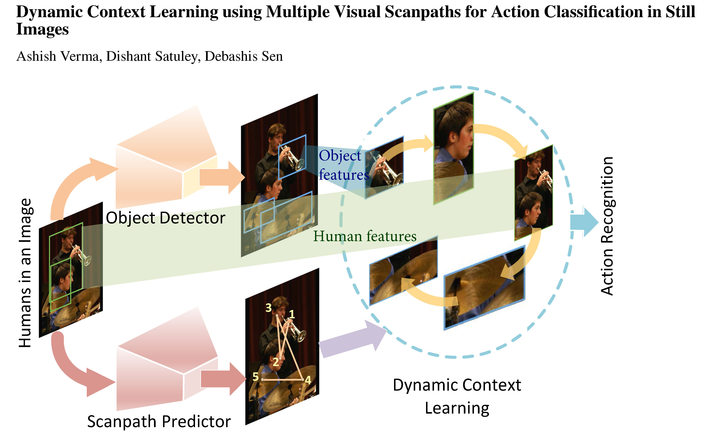

# Dynamic Context Learning using Multiple Visual Scanpaths for Action Classification in Still Images

## Introduction
Source code for the paper:  
**"Dynamic Context Learning using Multiple Visual Scanpaths for Action Classification in Still Images"**.

[Paper link](https://www.sciencedirect.com/science/article/pii/S1568494625018344)

Humans consistently recognize actions in images through visual observation by adeptly attending to the entities involved and identifying their contextual relationships. 
Drawing inspiration from this phenomenon, we propose a network that utilizes visual scanpaths to perform action classification in images. Specifically, the network consists of a novel dynamic context module (DCM) that implements human-like understanding by employing a scanpath-driven long short-term memory (LSTM) for enriched modeling of the dynamic interactions among visual entities involved in actions. The scanpaths on an image are generated using a human visual scanpath predictor, and our approach also includes the detection of object instances in an image and the extraction of their features. These features are subsequently enhanced by the DCM and then employed to perform the action classification. 
Extensive experiments demonstrate that integrating visual scanpaths improves action classification accuracy, achieving state-of-the-art results across different datasets. This reflects the effectiveness of our dynamic context learning strategy to perform human-like assessment for action classification in still images. This is corroborated by a thorough ablation study, which also establishes the contributions of the other model components.


## Installation
This project is developed using **Python 3.1.2** and Pytorch 1.11.0.

### Python Packages
```txt
numpy==1.22.3
torch==1.11.0
torchaudio==0.11.0
torchvision==0.12.0
opencv-python
matplotlib==3.8.3
timm==0.5.4
tqdm
scipy
```
### Datasets
```
VOC Action dataset: [Dataset Website](http://host.robots.ox.ac.uk:8080/pascal/VOC/voc2012/index.html#devkit), [Detected BBox and Scanpath Link] ()

Stanford 40 dataset: [Dataset Website](http://vision.stanford.edu/Datasets/40actions.html), [Detected BBox and Scanpath Link] ()

Please note: For ease of use, we provide pre-processed scanpaths (both original and predicted) and bounding boxes (predicted by FasterRCNN) used in the method described in the paper.

VOC 2012 dataset:
1.1 Download the dataset and extract it to ~/data/.
1.2 Download the Scanpaths and BBoxes and extract them to ~/data/VOCdevkit/VOC2012/.

Stanford 40 dataset:
2.1 Download the dataset and extract it to ~/data/.
2.2 Download the  Scanpaths and BBoxes and extract them to ~/data/Stanford40/.
```

## Citation
```
@article{verma2025dynamic,
  title={Dynamic context learning using multiple visual scanpaths for action classification in still images},
  author={Verma, Ashish and Satuley, Dishant and Sen, Debashis},
  journal={Applied Soft Computing},
  pages={114521},
  year={2025},
  publisher={Elsevier}
}
```

